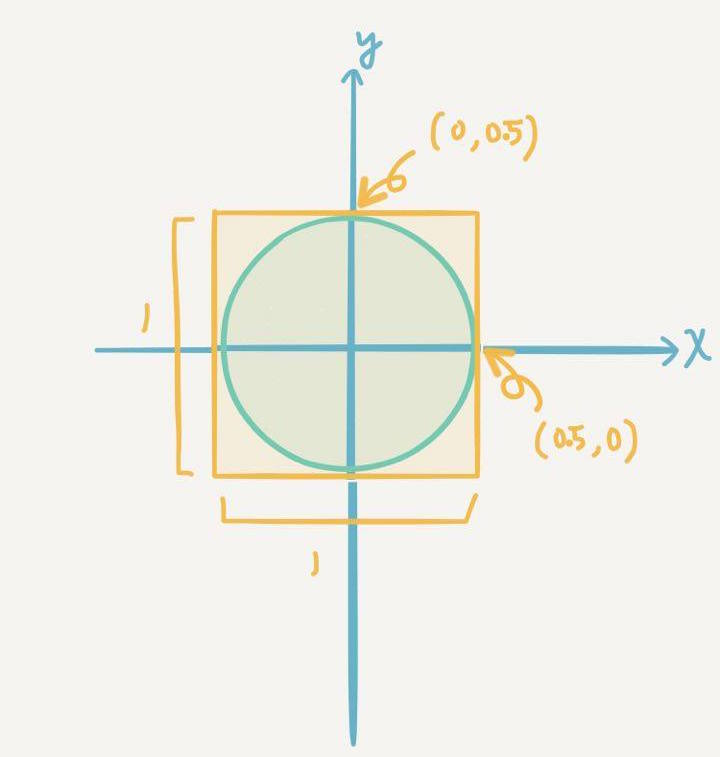

#使用Monte Carle Method 估計Pi值

###Introduction


在一xy座標平面上存在一個以(0,0)為圓心，半徑為0.5的圓。

該圓外切一正方形（如上圖所示）

若我們在該正方形內隨機抽樣出數千個點座標，並計算落在圓內點的數量與抽樣數的**比例值P**

依據**圓面積公式**與**正方形邊長為1**等資訊，可以推論出：
```coffee
r=0.5
P= (pi*r^2) / 1*1 
pi= P/(r*2)
```
如此一來便可得到一**估計pi值**，並期望隨著抽樣的點越多，得到的**估計pi值**越正確。

但這個點的數目要多少才夠呢？我們希望藉由R來幫助我們驗證這件事情。
####Installation 
```coffee
install.packages(c('ggplot2','scales'))
library(ggplot2) #plotting package 作圖套件
library(scales) #for displaying mathmatical symbols in R 使R能顯示數學符號
```
在執行程式前需先指定抽樣點的數量。在此例中抽樣數是從10^4個點，增加到10^8個點時結束迴圈，

每次迴圈結束會增加10^0.0125倍的抽樣數，共抽樣321次。

####Generating estimated pi 
```coffee
exp=321
break.x=.0125 

data.pi= c()
for (i in 1:exp){ 
  size=10^(3.9875+break.x*i) #指定抽樣數
  x=runif(size,min=-.5,max=.5) #由uniform dist.中隨機決定抽樣點的x值
  y=runif(size,min=-.5,max=.5) #由uniform dist.中隨機決定抽樣點的y值
  data=data.frame(x=x,
                  y=y,
                  r=sqrt(x^2+y^2) #計算點至圓心的距離，用來判定是否落在圓內
                  )
  data.pi[i]=(sum(data$r<=0.5)/size)*4 #儲存得到的Estimated Pi value
}
```
####Let's see what we got
```coffee
> length(data.pi) #檢驗資料長度
  [1] 321 
> data.pi
  [1] 3.146520 3.147499 3.142587 3.121161 3.152803 3.153549 3.144521
  [8] 3.152848 3.126373 3.175052 3.140053 3.159704 3.093168 3.116889
 [15] 3.121448 3.152515 3.154049 3.140093 3.156568 3.148662 3.138007
 [22] 3.150905 3.129390 3.150062 3.141135 3.132072 3.154830 3.162341
 [29] 3.163761 3.142145 3.149365 3.139155 3.136117 3.149066 3.143273
 [36] 3.142227 3.131127 3.148943 3.134067 3.130022 3.139048 3.136801
```
####Plotting
```coffee
plot=data.frame(epi=data.pi, 
                exp=10^(4+break.x*(1:e))
                )
g=ggplot(plot, aes(x=exp, y=epi))+ 
  geom_line(alpha=.8,colour="blue")+
  geom_point(alpha=.65, size=rel(2))+
  geom_hline(yintercept=pi,colour="red")+ 
  scale_y_continuous(breaks= c(round(pi,4),setdiff(seq(3.1,3.2,by=.002),c(3.142))))+
  scale_x_log10     (labels= trans_format("log10", math_format(10^.x)),
                     breaks= trans_breaks("log10", function(x) 10^x))+
  theme(axis.title.x= element_text(size=rel(2)),
        axis.text.x= element_text(size=rel(2.5)),
        axis.title.y= element_text(size=rel(2)),
        axis.text.y= element_text(size=rel(2))
        )+
  labs(x = "Exponent on 10", y ="Estimated pi")+
  coord_fixed(ratio=25)
ggsave("pi.png",g, scale=3)
getwd()
```


由圖片可以觀察到，當抽樣點大於10^7時，所得到的估計pi已經相當接近pi值
